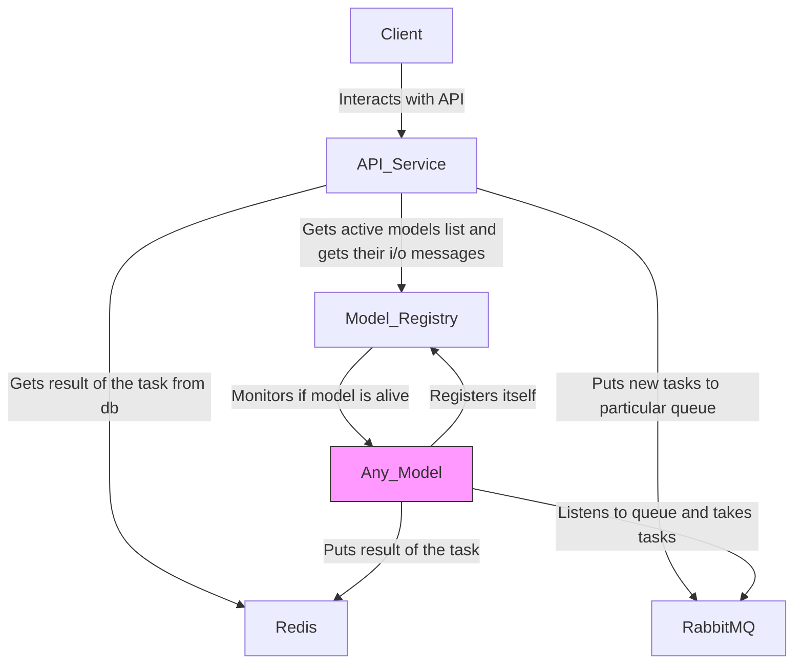

# Demo System

## Overview

This project demonstrates a simple modular microservices architecture for serving machine learning models. It includes:

- A FastAPI-based API service
- Two independent models (`ModelA`, `ModelB`)
- A model registry for managing available models
- Messaging support via RabbitMQ
- Optional caching or async support via Redis

## Architecture



Each model is isolated and can be scaled or extended independently.

## Components

- `api_service.py`: Main HTTP entrypoint
- `model_registry.py`: Registers and retrieves models
- `model_a.py` / `model_b.py`: Example ML models
- `proto/`: Contains protobuf definitions for structured data
- `load_testing/`: Performance testing tools
- `serialization_type_test/`: Serialization format experiments

## How to Run

### Using Docker Compose

```bash
docker-compose up --build
```

### Available ports:

- `API Service`: localhost:8000

- `RabbitMQ Admin`: localhost:15672

- `Redis`: localhost:6379

## Sending a Prediction

```bash
curl -X POST http://localhost:8000/predict/model_a -H "Content-Type: application/json" -d '{"data": "example"}'
```

## Development

### Install dependencies and run locally:

```bash
pip install -r requirements.txt
python api_service.py
```

## Tests

```bash
pytest tests/
```

## Docker

To simplify local setup, each component can be containerized.

Dockerfile in project root (or per service)

docker-compose.yml defines how services connect

## More info
In ABOUT.md file :)