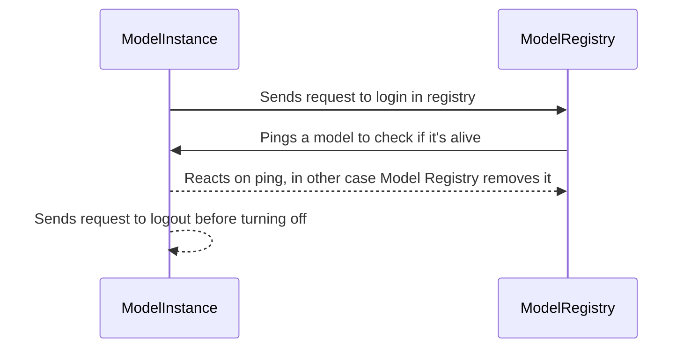

# About system

## Components

### Model Registry
Model Registry - это специальный компонент, который несет ответственность за регистрацию моделей, поддержание их статуса 
и исключение из системы в случае, если у модели не осталось живых инстансов. Когда модель поднимается, она автоматически 
делает запрос на регистрацию 


## How to add new model
Actually, there are only several things to make new model work:

1) Add input and output messages, that will represent i/o data for model to schema registry.
2) Implement process_request method of interface. This is the main method, that accepts request and produces result. Example:
```python
    async def process_request(self, body):
    model_a_request = models_pb2.ModelARequest()
    model_a_request.ParseFromString(body)
    response_obj = models_pb2.ModelAResponse()
    response_obj.reply = f"Processed message: {model_a_request.messages}\n"
    return response_obj
```
3) Implement get_request_format and get_response_format methods. They just return descriptors of messages:
```python
    def get_request_format(self):
        return models_pb2.ModelARequest.DESCRIPTOR

    def get_response_format(self):
        return models_pb2.ModelAResponse.DESCRIPTOR
```
4) Deploy model. Interface will do the rest of the work. It will register the model in model_registry and connect to RabbitMQ and Redis. It will start work!