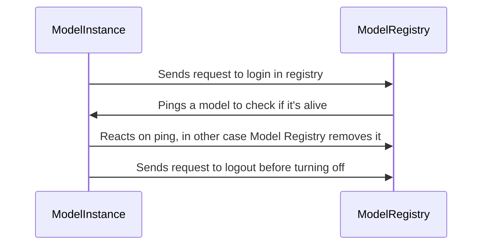
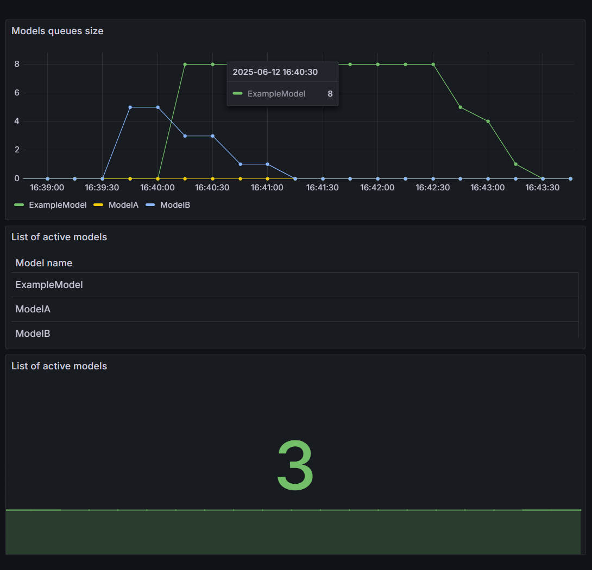
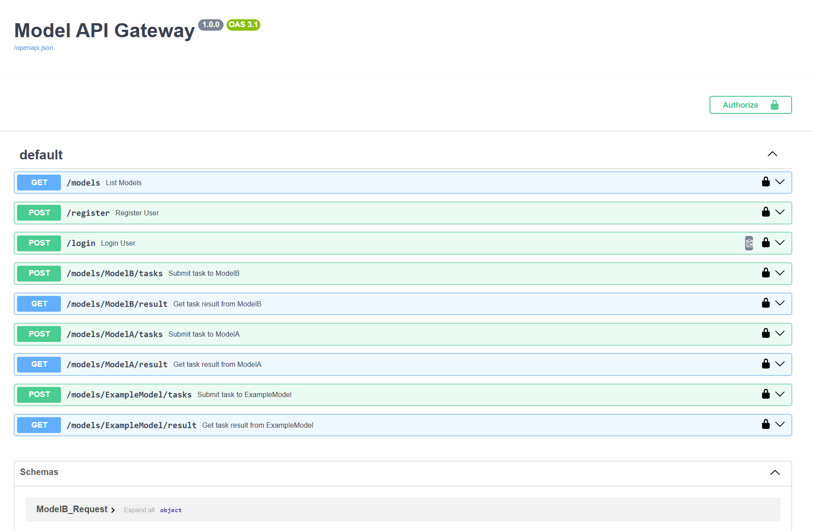
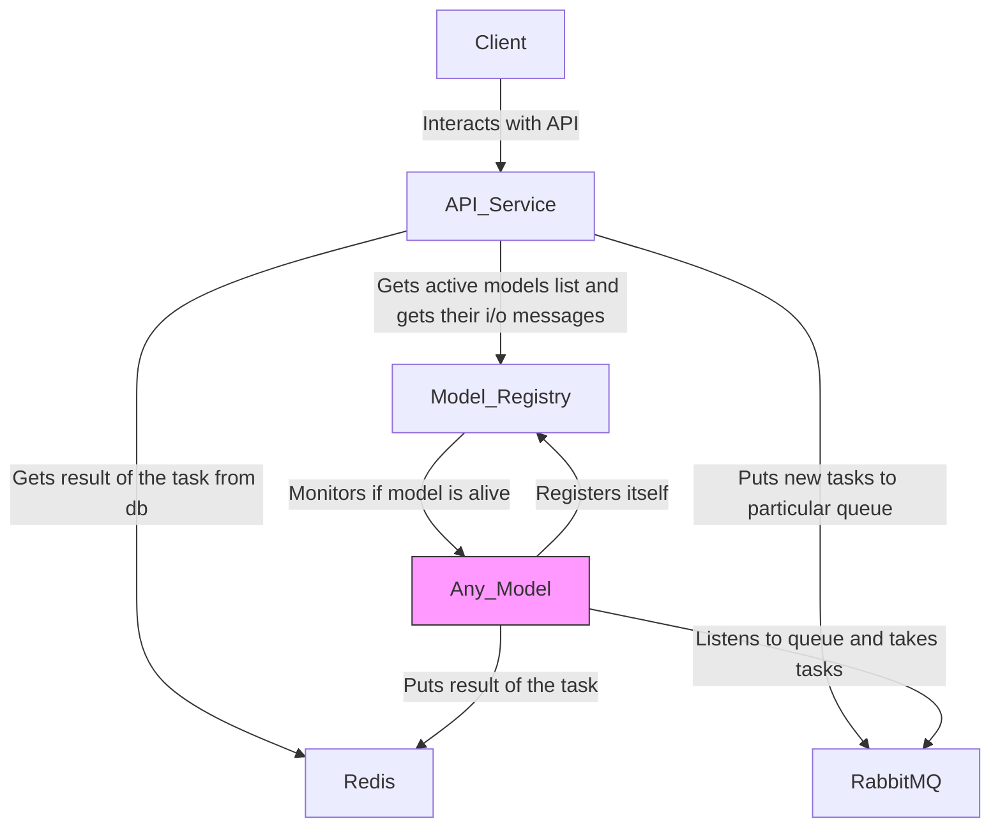

# About system

## Components

### Model Registry

The Model Registry is a special component that is responsible for registering models, maintaining their status
, and excluding them from the system if the model has no live instances left. When the model rises, it automatically
makes a registration request (see the section about the model interface). ModelRegistry stores the model (or rather its
instance)
in its database. It stores information about the model name and its host port. Further in a circle (by a separate
process) Model
Registry crawls the list of model instances and sends a ping request. By default, this is done once every 10 seconds.
Thanks
to these pings, we can ensure that only live models are reflected in the system. If for some reason a model was disabled
without a logout request from registry, we will respond anyway and stop showing it in the list of active models. This
allows
you to avoid making mistakes due to accessing a non-working model. It is worth adding that the model is excluded from
the list only then.,
when she doesn't have any live instances left. The Model Registry is also responsible for deduplication of models. That
is, if
we have a model named ModelA, and then we receive a request to register another model with the same name, but with
different
input-output classes (that is, it is a completely different model, but with the same name), the Model Registry returns
an error and informs
us that we cannot register the model with that name (since it is already occupied). The model also has its own
interface.
upon disconnection, it sends a request to disconnect from registry, so that it excludes the necessary instance and, if
necessary, removes
the model from the list of available ones. Also, Model Registry has a route for returning a list of active models.

In general, this is a component that is a source of information about live models for the entire system. Also on this
component
we count various metrics by model (number of live models, names of live models, queue in RabbitMQ for each
of the models). The approximate interaction between Model instance and Model Registry is quite simple:



### Metrics

Not going far from the Model Registry, which collects information about models and delivers these metrics to Prometheus.
On port 3000
you can see the finished dashboard. It currently consists of the 3 most important charts for tracking. This:

- The number of active models. It is the number of models that counts here, not their instances. It may be worth
  adding a graph with the number of live instances for each of the models later.
- The names of the models. This is a graph for convenience, to understand which models are included, if the number of
  live models !=
  total number of models.
- Queue for processing in each of the models. This is the most important schedule. It allows you to track and respond to
  the processing backlog.
  For example, you can add instances to lagging or just slow models.



### Interface

The interface that the model should implement (the model should support only 1 method for operation). The rest of the
functionality
is taken over by the interface:

1) *Registration in the Model Registry and a logging out request from the Model Registry.* When the model that
   implements the interface
   is launched, a request is made to the Model Registry (the address of the model registry is in the general config).
   Also, when switching off, it is sent before disconnecting.
   request for deletion from the Model Registry. It occurs without delay, because even if the request fails,
   the instance itself disappears from the registry due to pings.
2) *Connect to RabbitMQ, from where new tasks for models are obtained.* The model connects to the queue with its own
   name (each instance
   of the model does this). This happens with retreats. If the model cannot be connected to the task queue, it is
   disabled (since
   it will not do anything). Accordingly, a request is taken from the queue (all tasks are wrapped in a special Task
   class),
   an id is taken from the task, and the request body is sent to the request to receive a response (this method
   implements the model). Then
   the result of the function is stored in the database. The load is also distributed evenly between different instances
   of the model: each model
   takes on a new task for processing as it becomes available. RabbitMQ guarantees that each message will be delivered
   exactly once.
3) *Connect to Redis.* Redis was chosen as the database. It is well suited for such data: we need to store the results
   of completed tasks by id. Accordingly, the interface independently connects the model to Redis. Then, after
   completing the task
   , the interface independently puts it into the database by id, which it took out of a special Task wrapper.
4) *Handling pings.* Interface starts a back process for reacting on pings. They are used by Model Registry in this
   architecture
   but can be used to check it manually.
5) *Special routes for returning input/output message descriptors.* Interface has an info about input/output classes
   used
   by model. They are used by the Gateway for building the Swagger.

So by adding input/output messages to proto registry and implementing 1 method that takes input class, does the model
logic
and returns output class we are making new component that works in this system. All other integrations are done by
interface.
It is a big plus because developers should not change anything in full system. Example of integrating new model will be
further.

### Gateway

This is a component that an external user interacts with. It also has a number of functions:

1) *User registration and authorization.* Gateway has two routes `/login` and `/register'. As in any system
   , you cannot register 2 users with 1 login. When logging into the system, the user receives a JWT token with which
   he can interact with the models.
2) *Getting a list of models.* This is necessary so that the user can see which models are supported in the system.
   In the future, it is planned to add descriptions to the models for greater clarity.
3) *Sending a task to the model.* Route `/models/{model_name}/tasks` allows you to send a task to a model named
   `model_name`.
   The API supports 2 data formats: json and proto. When json is received using a descriptor obtained from the model,
   the data from the json
   is converted to a proto message, put together with the generated id in a special wrapper class Task and sent to
   RabbitMQ
   in a topic named `model_name`. If the proto data format is selected, then it is simply added to the Task and the same
   way.
   it is sent to RabbitMQ. The result of the `pending` is also placed in Redis, which is then replaced by the result of
   the task.
4) *Getting the task result from the model.* Route `/models/{model_name}/result` which accepts the task id as well as
   the parameter.
   Accordingly, the task is assigned from Redis by id, converted into an output class (due to the fact that we know what
   kind of model it is)
   using descriptor. The result can also be returned in json or proto format. Accordingly, the user can
   only get the result of his task, otherwise he will receive the 403 code.
5) *Dynamic swagger construction.* Due to the fact that Gateway knows information about models, it receives
   their descriptors from active models. A special method was written here in order to get the json structure of the
   model from the proto descriptor with the fields filled
   in with the default data. All these json schemas are added to the Swagger model list. Swagger also specifically has 2
   methods for each model: sending a task and receiving a task result. This is for the convenience of the developer when
   testing the system.,
   For each model, he will see the data format and easily fill in only the necessary fields. bytes are filled in in json
   with base64 format.
   

### Total architecture and communication



Each model is isolated and can be scaled or extended independently.

## How to add new model

Actually, there are only several things to make new model work:

1) Add input and output messages, that will represent i/o data for model to schema registry.
2) Implement process_request method of interface. This is the main method, that accepts request and produces result.

```python
    async def process_request(self, body):
```

3) Deploy model. Interface will do the rest of the work. It will register the model in model_registry and connect to
   RabbitMQ and Redis. It will start work!

### Example

Assuming we have such model, that takes a file and produces a brief description of text in file.
Initial code of the model:

```python
from transformers import pipeline
import os


def summarize_text_file(file_path):
    # Check if file exists
    if not os.path.exists(file_path):
        print(f"File not found: {file_path}")
        return

    # Read the file
    with open(file_path, 'r', encoding='utf-8') as file:
        text = file.read()

    if not text.strip():
        print("The file is empty.")
        return

    text = "summarize: " + text.strip().replace("\n", " ")
    # Load summarization pipeline with a light model
    summarizer = pipeline("summarization", model="t5-small", tokenizer="t5-small")

    # t5-small can handle up to ~512 tokens, limit to ~800 characters
    max_chunk = 800
    chunks = [text[i:i + max_chunk] for i in range(0, len(text), max_chunk)]

    summaries = []
    for chunk in chunks:
        result = summarizer(chunk, max_length=100, min_length=30, do_sample=False)
        summaries.append(result[0]['summary_text'])

    final_summary = " ".join(summaries)
    print("\n=== Summary ===\n")
    print(final_summary.strip())


# Example usage
if __name__ == "__main__":
    summarize_text_file("text_document.txt")
```

So we see the logic. As an input it should take some file (and maybe extra info) and as output return brief summary. So
we
add 2 messages for i/o classes for this model:

```proto
message ExampleModelRequest {
   File file = 1;
   string author = 2;
}

message ExampleModelResponse {
   string summary = 1;
   string fixed_author = 2;
}

message File {
   bytes content = 1;
}
```

Next step is implementing the interface. As a result we get the following code:

```python
from interface import BaseModel
from transformers import pipeline
from models_pb2 import ExampleModelRequest, ExampleModelResponse
from io import BytesIO


class ExampleModel(BaseModel[ExampleModelRequest, ExampleModelResponse]):
    request_cls = ExampleModelRequest
    response_cls = ExampleModelResponse

    def summarize_text_file(self, file):
        text = file.read().decode("utf-8")

        if not text.strip():
            print("The file is empty.")
            return ""

        text = "summarize: " + text.strip().replace("\n", " ")
        # Load summarization pipeline with a light model
        summarizer = pipeline("summarization", model="t5-small", tokenizer="t5-small")

        # t5-small can handle up to ~512 tokens, limit to ~800 characters
        max_chunk = 800
        chunks = [text[i:i + max_chunk] for i in range(0, len(text), max_chunk)]

        summaries = []
        for chunk in chunks:
            result = summarizer(chunk, max_length=100, min_length=30, do_sample=False)
            summaries.append(result[0]['summary_text'])

        final_summary = " ".join(summaries)
        return final_summary.strip()

    async def process_request(self, body):
        request = self.request_cls()
        request.ParseFromString(body)
        response_obj = self.response_cls()

        file = BytesIO(request.file.content)

        summary = self.summarize_text_file(file)

        response_obj.summary = summary
        response_obj.fixed_author = request.author + " (summarized by AI)"
        return response_obj


if __name__ == "__main__":
    model = ExampleModel("ExampleModel", 8003)
    model.run()
```

We just move most of the logic to interface and implement 1 method.

```python
    request_cls = ExampleModelRequest
response_cls = ExampleModelResponse
```

This lines are needed to pass the i/o classes to interface (it will be used for logic described above).

Then after deploying the model we can see the following 2 new methods in swagger (they will appear without restarting
any
of the components).

Method for creating new task:
[Method for creating new task](images/create_task_swagger.png)

Method for getting task result:
[Method for getting task result](images/task_result_swagger.png)