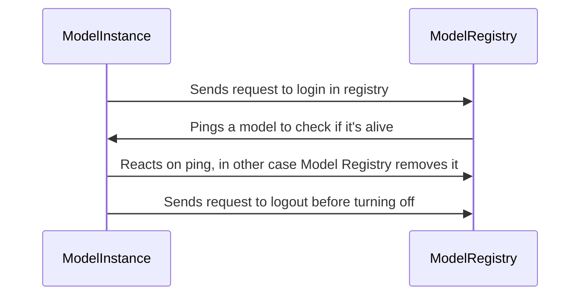

# About system

## Components

### Model Registry
The Model Registry is a special component that is responsible for registering models, maintaining their status
, and excluding them from the system if the model has no live instances left. When the model rises, it automatically
makes a registration request (see the section about the model interface). ModelRegistry stores the model (or rather its instance)
in its database. It stores information about the model name and its host port. Further in a circle (by a separate process) Model
Registry crawls the list of model instances and sends a ping request. By default, this is done once every 10 seconds. Thanks
to these pings, we can ensure that only live models are reflected in the system. If for some reason a model was disabled
without a logout request from registry, we will respond anyway and stop showing it in the list of active models. This allows
you to avoid making mistakes due to accessing a non-working model. It is worth adding that the model is excluded from the list only then., 
when she doesn't have any live instances left. The Model Registry is also responsible for deduplication of models. That is, if
we have a model named ModelA, and then we receive a request to register another model with the same name, but with different
input-output classes (that is, it is a completely different model, but with the same name), the Model Registry returns an error and informs
us that we cannot register the model with that name (since it is already occupied). The model also has its own interface.
upon disconnection, it sends a request to disconnect from registry, so that it excludes the necessary instance and, if necessary, removes
the model from the list of available ones.

In general, this is a component that is a source of information about live models for the entire system. Also on this component 
we count various metrics by model (number of live models, names of live models, queue in RabbitMQ for each
of the models). The approximate interaction between Model instance and Model Registry is quite simple:


### Metrics
Not going far from the Model Registry, which collects information about models and delivers these metrics to Prometheus. On port 3000
you can see the finished dashboard. It currently consists of the 3 most important charts for tracking. This: 
- The number of active models. It is the number of models that counts here, not their instances. It may be worth
adding a graph with the number of live instances for each of the models later.
- The names of the models. This is a graph for convenience, to understand which models are included, if the number of live models !=
total number of models.
- Queue for processing in each of the models. This is the most important schedule. It allows you to track and respond to the processing backlog.
For example, you can add instances to lagging or just slow models.


## How to add new model
Actually, there are only several things to make new model work:

1) Add input and output messages, that will represent i/o data for model to schema registry.
2) Implement process_request method of interface. This is the main method, that accepts request and produces result. Example:
```python
    async def process_request(self, body):
    model_a_request = models_pb2.ModelARequest()
    model_a_request.ParseFromString(body)
    response_obj = models_pb2.ModelAResponse()
    response_obj.reply = f"Processed message: {model_a_request.messages}\n"
    return response_obj
```
3) Implement get_request_format and get_response_format methods. They just return descriptors of messages:
```python
    def get_request_format(self):
        return models_pb2.ModelARequest.DESCRIPTOR

    def get_response_format(self):
        return models_pb2.ModelAResponse.DESCRIPTOR
```
4) Deploy model. Interface will do the rest of the work. It will register the model in model_registry and connect to RabbitMQ and Redis. It will start work!