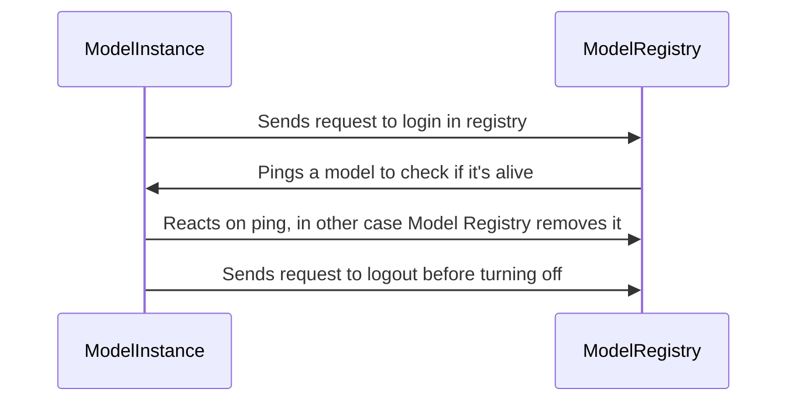

# About system

## Components

### Model Registry
The Model Registry is a special component that is responsible for registering models, maintaining their status
, and excluding them from the system if the model has no live instances left. When the model rises, it automatically
makes a registration request (see the section about the model interface). ModelRegistry stores the model (or rather its instance)
in its database. It stores information about the model name and its host port. Further in a circle (by a separate process) Model
Registry crawls the list of model instances and sends a ping request. By default, this is done once every 10 seconds. Thanks
to these pings, we can ensure that only live models are reflected in the system. If for some reason a model was disabled
without a logout request from registry, we will respond anyway and stop showing it in the list of active models. This allows
you to avoid making mistakes due to accessing a non-working model. It is worth adding that the model is excluded from the list only then., 
when she doesn't have any live instances left. The Model Registry is also responsible for deduplication of models. That is, if
we have a model named ModelA, and then we receive a request to register another model with the same name, but with different
input-output classes (that is, it is a completely different model, but with the same name), the Model Registry returns an error and informs
us that we cannot register the model with that name (since it is already occupied). The model also has its own interface.
upon disconnection, it sends a request to disconnect from registry, so that it excludes the necessary instance and, if necessary, removes
the model from the list of available ones. Also, Model Registry has a route for returning a list of active models.

In general, this is a component that is a source of information about live models for the entire system. Also on this component 
we count various metrics by model (number of live models, names of live models, queue in RabbitMQ for each
of the models). The approximate interaction between Model instance and Model Registry is quite simple:


### Metrics
Not going far from the Model Registry, which collects information about models and delivers these metrics to Prometheus. On port 3000
you can see the finished dashboard. It currently consists of the 3 most important charts for tracking. This: 
- The number of active models. It is the number of models that counts here, not their instances. It may be worth
adding a graph with the number of live instances for each of the models later.
- The names of the models. This is a graph for convenience, to understand which models are included, if the number of live models !=
total number of models.
- Queue for processing in each of the models. This is the most important schedule. It allows you to track and respond to the processing backlog.
For example, you can add instances to lagging or just slow models.


### Interface
The interface that the model should implement (the model should support only 1 method for operation). The rest of the functionality
is taken over by the interface:
1) *Registration in the Model Registry and a logging out request from the Model Registry.* When the model that implements the interface
is launched, a request is made to the Model Registry (the address of the model registry is in the general config). Also, when switching off, it is sent before disconnecting. 
request for deletion from the Model Registry. It occurs without delay, because even if the request fails,
the instance itself disappears from the registry due to pings.
2) *Connect to RabbitMQ, from where new tasks for models are obtained.* The model connects to the queue with its own name (each instance
of the model does this). This happens with retreats. If the model cannot be connected to the task queue, it is disabled (since
it will not do anything). Accordingly, a request is taken from the queue (all tasks are wrapped in a special Task class),
an id is taken from the task, and the request body is sent to the request to receive a response (this method implements the model). Then
the result of the function is stored in the database. The load is also distributed evenly between different instances of the model: each model
takes on a new task for processing as it becomes available. RabbitMQ guarantees that each message will be delivered exactly once.
3) *Connect to Redis.* Redis was chosen as the database. It is well suited for such data: we need to store the results
of completed tasks by id. Accordingly, the interface independently connects the model to Redis. Then, after completing the task
, the interface independently puts it into the database by id, which it took out of a special Task wrapper.
4) *Handling pings.* Interface starts a back process for reacting on pings. They are used by Model Registry in this architecture
but can be used to check it manually.
5) *Special routes for returning input/output message descriptors.* Interface has an info about input/output classes used 
by model. They are used by the Gateway for building the Swagger.

So by adding input/output messages to proto registry and implementing 1 method that takes input class, does the model logic
and returns output class we are making new component that works in this system. All other integrations are done by interface. 
It is a big plus because developers should not change anything in full system. Example of integrating new model will be 
further.


## How to add new model
Actually, there are only several things to make new model work:

1) Add input and output messages, that will represent i/o data for model to schema registry.
2) Implement process_request method of interface. This is the main method, that accepts request and produces result. Example:
```python
    async def process_request(self, body):
    model_a_request = models_pb2.ModelARequest()
    model_a_request.ParseFromString(body)
    response_obj = models_pb2.ModelAResponse()
    response_obj.reply = f"Processed message: {model_a_request.messages}\n"
    return response_obj
```
3) Implement get_request_format and get_response_format methods. They just return descriptors of messages:
```python
    def get_request_format(self):
        return models_pb2.ModelARequest.DESCRIPTOR

    def get_response_format(self):
        return models_pb2.ModelAResponse.DESCRIPTOR
```
4) Deploy model. Interface will do the rest of the work. It will register the model in model_registry and connect to RabbitMQ and Redis. It will start work!